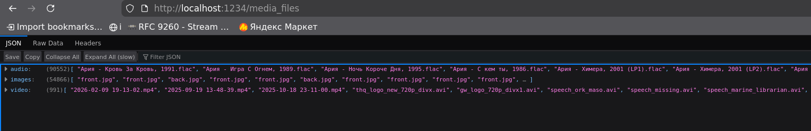

# Fs Indexer

Приложение выполняет периодический обход заданного каталога переданного через аргументы программе (по умолчанию обход
происходит по домашней папки юзера запустившего программу) для поиска мультимедийных файлов (аудио, видео, изображения)
и генерации JSON файла с названиями файлов. В случае если программе будет передан интервал меньший чем время за которое 
приложение способно произвести сканирование файовой системы, результат будет выдан по окончанию сканирования. Если во 
время работы программы папка переданная в path будет удалена, то приложение продолжит работу и будет выдавать пустой 
JSON.

Программа способна распознавать файлы по их расширениям: .mp3, .wav, .flac, .ogg, .m4a, .mp4, .mkv, .avi, .mov, .wmv, 
.jpg, .jpeg, .png, .gif, .bmp, .webp

Результирующий JSON может быть получен по HTTP GET запросу к (`http://localhost:1234/media_files`).

## Требования для сборки

- ОС: Linux
- Компилятор реализующий ISO C++17
- CMake (версия 3.20 или выше)

В проекте используются header-only библиотеки `nlohmann/json` (генерация JSON) и `cpp-httplib` (HTTP-сервер), они уже
включены в исходный код.

Для развертывания сборочного окружения с нужными версиями компилятора и CMake при использовании **Nix/NixOS** на
хост-машине, выполните:

```bash
nix-shell
```

## Сборка и запуск

Исполнить в корне репозитория:

```bash
mkdir build
cd build 
cmake .. 
make
```

Запуск:

```bash
#Запуск с фоновом режиме:
./fs-indexer &
#Запуск с кастомными параметрами
./fs-indexer --path /shared -i 5
```

Для проверки работы приложения:
```bash
#В случае не готовности JSON будет возвращен пустой HTTP:
curl http://localhost:1234/media_files
#Или запуск в браузере, привер с firefox (Если установлен):
firefox http://localhost:1234/media_files
```

## Примеры вывода JSON:

Запуск натравленный на раздел с медиа файлами:

